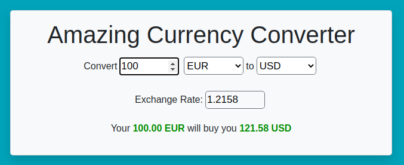

# Currency Converter

Online currency converter React application, using rates pulled from [Foreign exchange rates API ](https://exchangeratesapi.io/)

Application is automatically built, tested and deployed with [GitHub Actions](https://github.com/eldocbrown/currency/actions) and can be used at this repository's [GitHub Pages](https://eldocbrown.github.io/currency/)

Tests are built with [Jest](https://jestjs.io/) and [React Test Renderer](https://reactjs.org/docs/test-renderer.html), and pipeline is set to deploy the app on +90% code coverage only, and no tests failures.

This project was bootstrapped with [Create React App](https://github.com/facebook/create-react-app).
